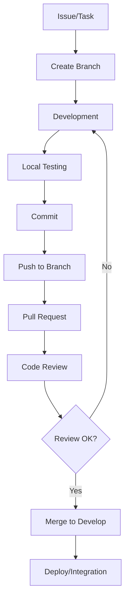

# Guia de Contribuição - Compilador Grupo 09

## Introdução

Este documento define as diretrizes completas para contribuição no projeto do compilador desenvolvido pelo **Grupo 09**. Seguindo estas práticas, garantimos qualidade, consistência e colaboração efetiva entre todos os membros da equipe.

## Workflow de Desenvolvimento

### Metodologia Ágil - Scrum Adaptado

Seguimos uma metodologia baseada em Scrum adaptada para projetos acadêmicos de compiladores:

- **Sprints**: 2 semanas cada (média)
- **Daily Meetings**: Quartas-feiras (presencial)
- **Sprint Review**: Final de cada Sprint
- **Sprint Planning**: Início de cada Sprint

### Fluxo de Trabalho



## Padrões de Commits

Seguimos os padrões do [Conventional Commits](https://www.conventionalcommits.org/en/v1.0.0/) adaptados para projetos de compiladores.

### Tipos de Commit Específicos para Compiladores

| Tipo | Descrição | Exemplo | Componente |
|------|-----------|---------|------------|
| **lexer** | Mudanças no analisador léxico | `lexer: Adiciona suporte a strings multiline` | Flex |
| **parser** | Mudanças no analisador sintático | `parser: Implementa regras para estruturas de controle` | Bison |
| **semantic** | Mudanças na análise semântica | `semantic: Adiciona verificação de tipos para arrays` | C/C++ |
| **codegen** | Mudanças na geração de código | `codegen: Implementa geração para loops while` | C/C++ |
| **ast** | Mudanças na árvore sintática | `ast: Adiciona nós para declarações de função` | Estruturas |
| **symbol** | Mudanças na tabela de símbolos | `symbol: Implementa escopo aninhado` | Hash Table |
| **opt** | Otimizações de código | `opt: Adiciona constant folding` | Optimizer |
| **test** | Testes específicos de compilador | `test: Adiciona testes para análise léxica` | Test Suite |
| **grammar** | Mudanças na gramática | `grammar: Refatora regras de expressões` | BNF/EBNF |
| **feat** | Nova funcionalidade geral | `feat: Adiciona suporte a comentários` | Geral |
| **fix** | Correção de bugs | `fix: Corrige vazamento de memória no parser` | Geral |
| **docs** | Documentação | `docs: Atualiza especificação da linguagem` | Markdown |
| **build** | Sistema de build | `build: Adiciona target para debug no Makefile` | Make/CMake |
| **style** | Formatação de código | `style: Aplica clang-format nos arquivos C` | Formatação |
| **refactor** | Refatoração | `refactor: Reorganiza estrutura de diretórios` | Arquitetura |

### Formato dos Commits

```bash
<tipo>[escopo opcional]: <descrição>

[corpo opcional]

[rodapé opcional]
```

### Exemplos Práticos

```bash
# Análise Léxica
lexer: Adiciona reconhecimento de números científicos
lexer(tokens): Define tokens para operadores lógicos
lexer: Implementa estados para comentários de bloco

# Análise Sintática  
parser: Implementa regras para declarações de variáveis
parser(grammar): Adiciona precedência para operadores aritméticos
parser: Corrige conflito shift/reduce em expressões

# Análise Semântica
semantic: Implementa verificação de tipos para operadores
semantic(scope): Adiciona suporte a escopos aninhados
semantic: Adiciona verificação de inicialização de variáveis

# Geração de Código
codegen: Implementa geração para estruturas condicionais
codegen(opt): Adiciona otimização de expressões constantes
codegen: Adiciona suporte a chamadas de função

# Testes
test(lexer): Adiciona testes para números decimais
test(integration): Implementa testes end-to-end
test: Adiciona cobertura para análise semântica

# Documentação
docs: Atualiza especificação da gramática
docs(api): Documenta interface da tabela de símbolos
docs: Adiciona exemplos de uso da linguagem
```

### Regras de Commit

1. **Língua**: Português brasileiro
2. **Tamanho**: Máximo 72 caracteres na primeira linha
3. **Formato**: Imperativo presente ("Adiciona" não "Adicionado")
4. **Escopo**: Opcional, mas recomendado para componentes específicos
5. **Corpo**: Detalhar o "porquê" quando necessário
6. **Breaking Changes**: Usar `!` após o tipo para mudanças incompatíveis

### Commits com Breaking Changes

```bash
parser!: Altera interface da AST para suportar tipos genéricos

BREAKING CHANGE: A estrutura ASTNode agora requer campo type_info
```

## Estratégia de Branches

### Git Flow

```
main (código principal)
├── dev/lexer-strings
├── dev/parser-functions  
├── dev/semantic-types
└── dev/memory-leak-fix

docs (documentação principal)
├── doc/grammar-specification
├── doc/api-documentation
└── doc/user-manual
```

### Branches Principais

| Branch | Propósito | Proteção | Merge |
|--------|-----------|----------|-------|
| **main** | Código principal do compilador | ✅ Protegida | Via PR aprovado |
| **docs** | Documentação principal | ✅ Protegida | Via PR aprovado |

### Branches de Trabalho (Temporárias)

#### Nomenclatura Padrão

```bash
# Desenvolvimento de Código (partem de main)
dev/<descrição/objetivo>
dev/lexer-scientific-numbers
dev/parser-control-structures
dev/semantic-type-checking
dev/codegen-expressions
dev/memory-leak-fix
dev/optimization-constant-folding

# Documentação (partem de docs)
doc/<descrição/objetivo>
doc/grammar-specification
doc/api-documentation
doc/user-manual
doc/installation-guide
doc/technical-specs
doc/contributing-update
```

### Fluxo de Branch

#### Para Desenvolvimento de Código

```bash
# 1. Criar branch de desenvolvimento
git checkout main
git pull origin main
git checkout -b dev/lexer-scientific-numbers

# 2. Desenvolver e testar
# ... fazer mudanças ...
git add .
git commit -m "lexer: Adiciona suporte a notação científica"

# 3. Manter atualizado com main
git fetch origin
git rebase origin/main

# 4. Push e Pull Request
git push origin dev/lexer-scientific-numbers
# Criar PR no GitHub: dev/lexer-scientific-numbers → main

# 5. Após merge, limpar branch local
git checkout main
git pull origin main
git branch -d dev/lexer-scientific-numbers
```

#### Para Documentação

```bash
# 1. Criar branch de documentação
git checkout docs
git pull origin docs
git checkout -b doc/grammar-specification

# 2. Atualizar documentação
# ... fazer mudanças ...
git add .
git commit -m "docs: Adiciona especificação completa da gramática"

# 3. Manter atualizado com docs
git fetch origin
git rebase origin/docs

# 4. Push e Pull Request
git push origin doc/grammar-specification
# Criar PR no GitHub: doc/grammar-specification → docs

# 5. Após merge, limpar branch local
git checkout docs
git pull origin docs
git branch -d doc/grammar-specification
```

## Code Review

### Processo de Revisão

1. **Autor do PR**:
   - Código compila sem warnings
   - Testes passam localmente
   - Documentação atualizada
   - Self-review completo

2. **Reviewers** (mínimo 1, recomendado 2):
   - Verificar lógica e algoritmos
   - Validar padrões de código
   - Testar funcionalidade
   - Aprovar ou solicitar mudanças

3. **Merge**:
   - Squash commits se necessário
   - Merge para main (código) ou docs (documentação)
   - Delete branch de trabalho


### Template de Pull Request

```markdown
[PC{num}] Objetivo/ação principal #{num}

## Descrição

Este Pull Request implementa [descrição detalhada da funcionalidade/correção]. 
[Explicar o contexto, motivação e impacto das mudanças realizadas].

## Funcionalidades Implementadas

### [Componente Principal - ex: Analisador Léxico]
- [ ] Funcionalidade 1
- [ ] Funcionalidade 2
- [ ] Funcionalidade 3

### [Componente Secundário - ex: Sistema de Compilação]
- [ ] Funcionalidade 1
- [ ] Funcionalidade 2

### [Outros Componentes]
- [ ] Funcionalidade 1
- [ ] Funcionalidade 2

## Tipo de mudança

- [ ] Atualização de documentação existente
- [ ] Adição de novo conteúdo
- [ ] Correção de erros ou bugs
- [ ] Refatoração
- [ ] Nova funcionalidade (lexer/parser/semantic/codegen)
- [ ] Melhoria de performance
- [ ] Outras alterações

## Tecnologias Utilizadas

- **Ferramenta 1** - Descrição do uso
- **Ferramenta 2** - Descrição do uso
- **Ferramenta 3** - Descrição do uso
```


---
<div align="center">
  <strong>Guia de Contribuição - Grupo 09</strong><br>
  <sub>Compiladores 1 - UnB/2025.2</sub>
</div>
